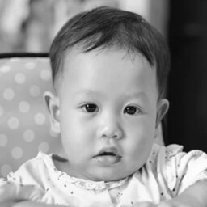
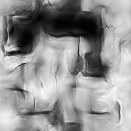
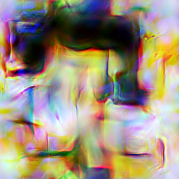
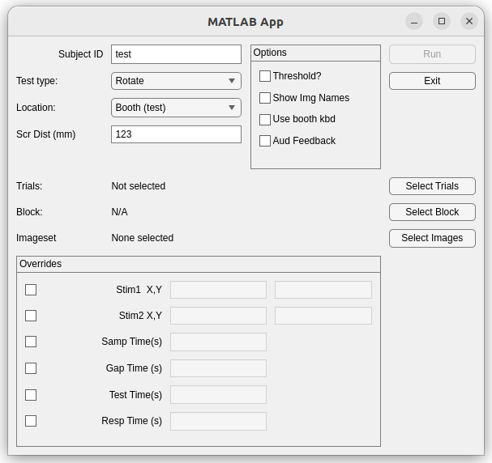

# cclab_ethosal
Ethological salience expt

## setup

The script *local_ethosal* should be copied to somewhere in your MATLAB path. The file in this repo named *local_ethosal_EDIT_AND_COPY.m* is a template. The key folders (this script just places variables with the paths in the current workspace) are

- **ethDataRoot** - root folder for input and output data. There should be subfolders named 'input' and 'output'.
- **ethImgRoot** - root folders for imagesets. The location of [cclab-images](https://github.com/djsperka/cclab-images.git) is a good choice.

## imageset and imageset parameters

The images used in the experiment are accessed via the imageset class. The imageset is collection of images where each image may have one or more different types or versions, and each type/version is stored in a different folder, but with *the same name*. 

Each folder is assigned a key (a single letter), and each image is associated with a key consisting of its folder key, and its filename (without extension). The images used for etholog are named *1.bmp*, *2.bmp*, ..., and the folder keys used are letters like *H* and *L* (for black and white image and texture, respectively), and *C* and *D* (for color image and texture, respectively). So, the keys and images for one of the images look like this:

| H/1 | L/1 | C/1 | D/1 |
| :-: | :-: | :-: | :-: |
|  |  |   |  | 


## input and results files

Input trials are generated by the script `generateEthBlocksImgV2`. Older versions were generated by the other similarly-named scipts (they're no longer used and probably will not run). 

The experiment will display two images at once. The positions of the two images can be specified on the etholog command line, but the defaults have been used throughout the experiment. The input parameters refer to *stim1* and *stim2* - these are the *left-* and *right-* hand images, respectively.


| Column | Input/Output | Description |
| :----- | :----------- | :---------- |
| ImagePairIndex | In(*) | unique index for each pair of images |
| Folder1KeyColumn | In(*) | column of Hi/Low salience folder pair for stim1 |
| Folder2KeyColumn | In(*) | column of Hi/Low salience folder pair for stim2 |
| Folder1KeyRow | In(*) | row index for Hi/Low folder pair for stim 1 |
| Folder2KeyRow | In(*) | row index for Hi/Low folder pair for stim 2 |
| StimTestType | In(*) | stim to test - this stim is shown in presentation B |
| StimChangeTF | In(*) | 0(1) for trials with no-change (changed-image) |
| Folder1Key, Folder2Key | In | Folder key used |
| File1Key,File2Key | In | File key used (same as image file basename) |
| StimA1Key, StimA2Key | In | Image keys for presentation A |
| StimB1Key, StimB2Key | In | Image keys for presentation B |
| StimChangeType | In | Which image changes on presentation B (0 means no change) |
| Stim1Ori,Stim2Ori | In | Original orientation of images, -1 means flipped, 1 means not flipped |
| SciTrialType | In | H/L are high/low salience (regardless of whether images are bw, color, nature, food); first letter is tested image |
| CueSide | In | For goal-directed expts, this is the side which is cued |
| FixationTime, MaxAcquisitionTime, FixationBreakEarlyTime, FixationBreakLateTime, SampTime, GapTime, RespTime, TestTime | In | Timing parameters for each trial (same throughout the entire block) |
| Started | Out | (T/F) Was the trial started? |
| trialIndex | Out | Index of trial in the generated input file. When trials are ended early, they are repeated later in the session. This value remains the same, use it to verify that all trials were completed. |
| tAon | Out | stimulus A onset timestamp |
| tAoff | Out | stimulus A offset timestamp |
| tBon | Out | stimulus B onset timestamp |
| tBoff | Out | stimulus B onset timestamp |
| tResp | Out | time response was given | 
| iResp | Out | response: 0=no change, 1=change, -4=fixation break, -3 no response before timeout, -1 = trial not started |


(*): These values are randomly generated. All other stim-related input values are derived from these values.

## Generating trials for specific experiment types

Make sure *ethDataRoot* and *ethImageRoot* are set via **local_ethosal** or the equivalent. 
This can be done on any machine, but the *ethImageRoot* should contain the same image set you use 
here.

Load the imageset you will use - commands for each experiment type are below. The image set names refer 
to the cclab-images repo (this repo's folder should be the same as *ethImageRoot*).

### Ethological salience, baby faces

### Ethological salience, three categories (baby, burgers, bushes)

### Ethological salience, burgers

Use food images in folder *food/* and *food-tex/*. 

```
img=imageset(fullfile(ethImgRoot,'MoreBabies'), 'paramsCircEdge256_food');
[blocks, inputArgs, parsedResults, scriptName] = generateEthBlocksImgV2(img.BalancedFileKeys, [50,0,0], FolderKeys={'F';'f'},Base=4, NumBlocks=3, FlipPair=true);
makeEthologInput(ethDataRoot, 'rimg', 'exp', '50food_neutral', img, blocks{:}, inputArgs, parsedResults, scriptName);
```

## how to run an experiment

A block of trials is run by the function *ethologSingleTest*. A MATLAB helper app will launch it. To run the dialog, run `local_ethosal_dlg` (the script `local_ethosal` should also be present and configured).

Running the script *local_ethosal_dlg* opens this dialog:



The items in the dialog and their meanings:

- **Subject ID** - An identifier for the subject. Will be incorporated into output file.
- **Test Type** - Will the *test* image be a rotated img, flipped img, modified img or a gabor?
- **Threshold?** - if checked, will run threshold data of selected test type
- **Show Image Names** -if checked, image keys will be displayed on top of the images. For testing. Requires Computer Vision Toolbox.
- **Location** - Select *Booth(test)* to run in EEG booth, but without eye tracking (for testing button box). Select Booth(subj) to run a subject in the booth. Select *Desk* to run on Dan's desk.
- **Scr Dist (mm)** - Screen distance (eye to center of screen), in mm. (8/6/24 this is not used at present)

Normally, you can click "Select Trials", and choose the trials file. The type of file you are presented with will depend on whether you've checked "Threshold", and which **Test type** you've selected.

If the trials file has blocks, then you will be presented with a dialog to select  the block number to run.

The data file created will be placed in **ethDataRoot**/output. The filename will be *yyyy-MM-dd-HHmm_subjectId_inputfile_blk#*, where *yyyy-MM-dd-HHmm* is the date/time the experiment was started, *subjectID* is from the dialog, and *inputfile* is the base name of the input (mat) file used. If a block is chosen, then *blk#* would indicate which block was run.

The **Run** button will not activate until the subject ID is not empty, and a file/block are selected. You cannot interact with the dialog while the experiment is running. 

### Overriding trial settings

Stim position and trial timing values can be modified. To change the configured values, first check the 
checkbox to the right of the value, and specify the value. All timing values are in seconds, and the 
stim position x,y values are in degrees. When you click *Run*, only the values next to **checked** boxes are used. 
Any other values, even if visible, are ignored.

The initial values shown in the dialog are those which are available at run time. 
(9/11/2024) The stim x,y positions are not known at this point: all stim size,position,color qualities
are specified on the command line, not in the trials file. The current default values for the stim are 
```Stim1XY = [-7,0]; Stim2XY = [7,0];```. 

### Running multiple blocks

When a subject must be run through multiple blocks in a data file, use the dialog to run the first block. After that block is done, click **Select block**, select the next block, click **OK**, and then you can hit **Run** again. A new data file will be created, its name will use the new block number.

## Running a block of trials

When a block of trials is launched, the stimulus screen will first display the PTB initialization screen, then switch to a gray background with some text written in the upper left corner. At this point, the MATLAB script is paused, waiting for the eye tracker to "exit setup". This is where the experimenter can calibrate the subject, adjusting camera if needed. The experiment waits until the experimenter hits the "Exit Setup" button on the tracker screen.

When trials are running, the keyboard is taken over completely by MATLAB. Do not open other apps and use the keyboard in them! MATLAB, and the experiment, will intercept your keystrokes, and you might inadvertently pause or quit the block. 

Control keys you can use during a block are:
- <space> - the space bar toggles pause/unpause
- **d** - when paused, this will initiate a drift correction. See below for details.
- **s** - when paused, this will switch eye tracker to setup mode. You can recalibrate, adjust camera, etc. When finished, hit **Exit Setup** on tracker interface.

### Eyetracking problems

Recovering from eyetracking problems during data collection. Assuming you have already set up the system for a participant, and they've completed a calibration successfully. 

Sometimes, over the course of a series of trials, the subject changes position slightly. This will cause the tracker to report eye poisition. Over time, this incorrect position "drifts", and may make it difficult for a subject to get within a fixation window. 

Other times, the participant may move away from the chinrest. When they return, their head is in a slightly different location, and tracking is off. Or, the tracker picked up the wrong location as the pupil (e.g. a nostril!).

If you are already paused, then the best choice is to hit **s** on the MATLAB machine. This changes the tracker to "Camera Setup", and you can fix the tracking problems. 

Smaller tracking errors like a drift are more easily fixed with a *drift correction*. 

Normally, a drift correction works like this:

1. Experimenter PAUSE expt (space bar)
2. Tell participant a drift correction is coming
3. Experimenter hits**d** on keyboard (the matlab computer). 
4. When participant fixates on the cross (eye position on tracker will probably NOT align with the center "+"), click "Accept Fixation". If the eye was stationary, the tracker will accept, then automatically adjust its calibration and re-start the expt (no need to un-pause with space bar - it is automatic)
5. If the eye is not stationary when you hit "Accept Fixation", then nothing happens! You might notice a small pair or rectangles, red and green, which indicate when eye is moving (red) or stationary (green). The tracker requires that when you hit "Accept" that the eye is stationary. If it isn't, then nothing happens. That's OK - just try again. 


If you are in a drift correction (expt was paused, and you hit **d**) but the tracker is badly misconfigured, you can hit **ESC**, and the tracker switches to "Camera Setup". You can take steps here to correct tracking problems, but when finished, **you MUST click on the tracker's "OUTPUT/RECORD" button!** The tracker exits setup and the drift correction, and the experiment resumes. 

Important to note that when you enter "Camera Setup" via a *pause*/***s*** sequence, or at initial calibration, you must hit "Exit Setup" to proceed. If you enter "Camera Setup" via a *pause*/***d***/**<ESC>** sequence, then you must hit "Output/Record" to proceed.

The sequence of clicks is crucial!


# Caution - below stuff may be out of date

## analysis

The script *analyze_ethdata_2* will load and analyze all the etholog data collected thus far. 

For each subject, the results from each block are loaded and concatenated into a single table. That table is passed to the script *anaeth* and results are returned in a struct. The fields in that struct and their meanings include:

- **ncorrectHH** - number of correct HH trials
- **ncompletedHH** - number of completed HH trials
- **drateHH** - detection rate for HH trials
- **treactHH** -avg reaction time for (correct) HH trials
- **dpHH** - dprime for HH trials
- **cHH** - criterion 
- **nincorrectHH0** - number of incorrect no-change HH trials
- **ncompletedHH0** - number of completed no-change HH trials
- **frateHH0** - false alarm rate for no-change HH trials

These same 9 values are repeated for each of the 4 stimulus configurations: *HH*, *HL*, *LH*, and *LL*.

### Generate trials

In order to generate trials, you must load an imageset (or at least have a list of the file keys for the image set you will use). When loading, provide a params argument for the folder mapping you will use. See [here](#imageset) for more.

The imageset used for ethosal is loaded differently, depending on the type of trial.

For the modified-image trials (regular trials, not threshold), pass 'FolderKeys' and 'TestKeys' (each is 2x1 cell of characters, each of which is a 'Folder Key' in the imageset). When a trial is chosen as a change trial, StimTestKey is formed using the 'TestKey' in the same position as the FolderKey for the changing side. 

In the example below, a trial where the change occurs on a side whose folder key is 'H' will have its StimTestKey formed using 'h' and that trial's ImageKey. 

The trials/blocks are now saved in a struct, with fields
- imagesetName - name of the imageset, i.e. its base folder name
- imagesetParamsFunc - params func to pass when loading the imageset
and one of the following
- blocks: array of tables, each with a block of trials
- trials: a single table of trials

Update: As of 9/8/2024 the struct has additional fields
- genFuncArgs - arguments input to the trial gen function
- genFuncParserResults - parser results from trial gen function
- genFuncName - name of the trial gen function

There is also a script, **makeEthologInput**, which will package up the blocks/trials into a mat file.

```
makeEthologInput(folder, ttype, etype, extra, img, blocksOrTrials, genFuncInputArgs, genFuncParserResults, genFuncName)
```    

The folder arg is an output folder. It should be the root of data
files. A subfolder named 'input' is used for the *mat* files created by
this script. The args are:

- ttype: test type, one of 'gab','mimg','rimg','rot'
- etype: exp type, one of 'thr' or 'exp'
- extra: becomes part of filename, ttype_etype_extra.mat
- img: imageset used
- blocksOrTrials: trials table or cell array of tables (i.e. blocks)
- inputArgs: args passed to the generator function
- parsedResults: results from the inputParser in the gen function
- scriptName: name of the script that generated the trials

The filename expected by the GUI is *testtype*_*exptype*_*whatever*.mat, where *testtype* can be *mimg* or *gab*, and *exptype* can be *thr* or *exp*. And *whatever* can be any legal file name stuff. The extension *mat* is required.

#### Generate trials for contrast-changed modified images

The imageset loaded should have the *unchanged* and *changed* natural and texture images. The "FolderKeys" for these locations are passed as the 'FolderKeys' (for unchanged) and 'TestKeys' (for changed) arguments below.

The first arg is the list of file keys that are 'balanced' - i.e. each image present in one of the subfolders is also present in each of the other subfolders. The list is a cell array of image keys - just the basename of the image files, no path and no extension.

The second arg is the number of images for [left, right] trials. Each image is presented on 8 trials. There are 4 possible left-right pairings (HH, HL, LH, LL), and each pairing is presented on a change trial *and* a no-change trial. Thus, the number of trials will be `(left+right)*8`. Here, we generate 640 trials, and split them into 3 blocks.

```
>> local_ethosal
>> blocks = generateEthBlocksImg(img.BalancedFileKeys, [40,40], 'FolderKeys',{'H';'L'},'TestKeys',{'h';'l'},NumBlocks=3);
Block 1 has 213 elements
Block 2 has 214 elements
Block 3 has 213 elements
>> S.blocks=blocks;
>> S.imagesetName=img.Name;
>> S.imagesetParamsFunc=img.ParamsFunc;
>> save(fullfile(ethDataRoot,'input','mimg_exp_40img-dlt20-x8-A.mat'), '-struct', 'S');
```

#### Generate trials for modified images threshold

In generateThresBlockProcImage, the deltas - the contrast changes - are hard-coded. Currently , the deltas are `[0;0;10;20;30;40]`. By treating 0 as a delta, we make 1/3 of all trials no-change trials. Trial multiplicity is determined by the number of images (second arg), high/low salience images (hard-coded folder keys 'H' for high salience and 'Q' for low salience - x2), left/right (x2), and the deltas (x6). 

In the blocks structure, trials that change have StimChangeType = 1 (left change) or 2 (right change), and the value of 'Delta' is the contrast change.


```
local_ethosal   % ethDataRoot, ethImgRoot
img=imageset(fullfile(ethImgRoot,'babies_match_V2'),'params');
blocks=generateThreshBlockProcImage(img.BalancedFileKeys, 40, 'Threshold', true,'NumBlocks',3);
S.blocks=blocks;
S.imagesetName=img.Name;
S.imagesetParamsFunc=img.ParamsFunc;
save(fullfile(ethDataRoot,'input','mimg_thr_40img_00-40-A.mat'),'-struct','S');
```

#### Generate trials for gabor test

There is a different script here, but most command line args are the same. 

The second arg here are image counts for [change_left; change_right; change_none]. Images selected for each of these categories are presented in all 4 left-right pairings. Thus, the number of trials will be `(change_left+change_right+change_none)*4`.

```
>> blocks = generateEthBlocksSingleTest(img.BalancedFileKeys, [33;33;33],0,6,'TestTime', 0.1, 'FolderKeys',{'H';'L'}, 'NumBlocks', 2);
Block 1 has 198 elements
Block 2 has 198 elements
>> S.blocks=blocks;
>> S.imagesetName=img.Name;
>> S.imagesetParamsFunc=img.ParamsFunc;
>> save(fullfile(ethDataRoot,'input','gab_exp_99img-dlt20-x8-A.mat'), '-struct', 'S');
```

#### Generate trials for gabor threshold

Each image is presented on each side (x2), both H and L salience (x2), change and no-change (x2), with each contrast change (third argument - here x4). For the example below, there are `30*2*2*2*4 = 960` trials.

```
timg=imageset(fullfile(ethImgRoot,'babies_match_V2'),'tparams');
blocks=generateThreshBlockGabor(timg.BalancedFileKeys, 30, [2,4,6,8],'TestTime',0.1,'NumBlocks', 3);
clear S
S.blocks=blocks;
S.imagesetName = timg.Name;
S.imagesetParamsFunc = timg.ParamsFunc;
save(fullfile(ethDataRoot,'input','gab_thr_30-2468-B.mat'),'-struct','S');
```


### About the keyboard index

The keyboard index is used to get input from the experimenter.
Keystrokes can pause, quit, maybe even other stuff. 

One must first solve the mystery of what your keyboard index is.
Use this command:

```
>> [ind names allinf] = GetKeyboardIndices();
```


**MAC**
On my macbook, this command gives a single index, a device with the
name 'Apple Internal Keyboard / Trackpad'. I use this index with my
macbook (testing only) and it works fine. 


**LINUX (ubuntu 22.04.4)**

On the linux desktop, use the command ***xinput -list***:
```
dan@bucky:~/git/cclab_ethosal$ xinput -list
⎡ Virtual core pointer                    	id=2	[master pointer  (3)]
⎜   ↳ Virtual core XTEST pointer              	id=4	[slave  pointer  (2)]
⎜   ↳ Logitech USB Trackball                  	id=10	[slave  pointer  (2)]
⎣ Virtual core keyboard                   	id=3	[master keyboard (2)]
    ↳ Virtual core XTEST keyboard             	id=5	[slave  keyboard (3)]
    ↳ Power Button                            	id=6	[slave  keyboard (3)]
    ↳ Power Button                            	id=7	[slave  keyboard (3)]
    ↳ Sleep Button                            	id=8	[slave  keyboard (3)]
    ↳ Dell Dell USB Keyboard                  	id=9	[slave  keyboard (3)]
```

Your keyboard is listed as one of the "slave keyboard" entries. In particular, the name listed for your keyboard, 
here it is **Dell Dell USB Keyboard**, is important. The ***id=#*** values are NOT the same as the indices used in PTB. 
You need to run the ***GetKeyboardIndices*** command in Matlab.

```
>> [ind names allinf] = GetKeyboardIndices();
```

This is the contents of 'names':
```
>> names

names =

  1×5 cell array

    {'Virtual core XTEST key…'}    {'Power Button'}    {'Power Button'}    {'Sleep Button'}    {'Dell Dell USB Keyboard'}
```

Your task is to decide which of the 'names' best describes your
keyboard. In my case, the name matches exactly what is listed in the
***xinput*** command output, so I use the index at position 5 in the 
ind() array (from GetKeyboardIndices): for me ind(5) is 7, and I use
7 as my keyboard index. 

### Run

```
results=etholog(trials, imgbw, [600, 1000], 'ImageChangeType', 'contrast', 'EyelinkDummyMode', 1, 'Response', 'MilliKey', 'MilliKeyIndex', mkind, 'KeyboardIndex', kbind, 'Screen', 0, 'Rect', [1520 400 1920 700])
```


## Utilities

### eyetracker

Encapsulation of Eyelink tracker. Boilerplate code is hidden, this class initializes tracker in the same way as all the Eyelink examples, suitable for use in most lab situations. 

```
% for use with subject, set to 1 for mouse (not same as Eyelink "mouse mode")
% When using dummy mode (==1), calls to eyepos() will return the current MOUSE position on screen.
% This is independent of the Eyelink's mouse simulation mode! 
dummy_mode = 0;  

% dimensions of screen and screen dist, in mm
wh = [600,300];
dist = 900;

% name is an 8 character filename (without extension) for the EDF file.
% I think this is a throwback to the DOS days, when filenames had to
% be 8.3 chars.
edfname = 'myedf001';

% Now make the object, and initiate "Camera Setup"
% 'windowIndex' is the PTB window index. Yes, you have to have an open window
% to be able to use this object!
tracker=eyetracker(dummy_mode, wh, dist, edfname, windowIndex);

% Alternative call, skipping over the Camera Setup step
tracker=eyetracker(dummy_mode, wh, dist, edfname, windowIndex, 'DoSetup', false);

% Any time you are RECORDING (in the Eyelink sense), you can observe eye position. Thus,
% you have to call this to start the tracker recording:

tracker.start_recording()

% Either of these stops recording. The Eyelink uses the term "offline" for when the tracker is not recording. 
% In other words, you only need to call one of these - they're the same.

tracker.offline();
tracker.stop_recording();

% Getting/testing eye position
[eyeX, eyeY] = tracker.eyepos();

% Is the current eye position inside this rectangle?
tf = tracker.is_in_rect(rect_in_screen_pixels);

% Is the current eye position inside one of a group of rectangles?
% Each rectangle is a COLUMN in the array, which must be 4xN:
% The return is a row vector, each element corresponds to the
% rect in that column
S = tracker.saccade(rectangles_in_columns);

% Once you're done and you want to fetch the edf file (optional), call this.
% This is the simplest call, the file is copied to the current (matlab) folder, with the same
% filename as that used when the eyetracker object was created.

tracker.receive_file();

% If you want to use the same filename, but move it in to a different folder. The second arg
% tells if the first arg was a pathname (1) or filename (with or without a path, 0).

tracker.receive_file('/home/cclab/data', 1);

% To give it a folder and a different name

tracker.receive_file('/home/cclab/data/newname.edf', 0);

```

### makeWindow
Its useful to be able to quickly create a window on screen. This function lets you specify the dimensions of the window, and where on your desktop you want it. 
Below, it creates an 800x600 window at the center of the right-hand side of screen 0. (See docs for AlignRect for last two args).

```
>> [w, wrect] = makeWindow([800, 600], 0, 'center', 'right');
```

Close the window with **sca** or **Screen('CloseAll')**. 

If the window is open, the value of w can be used for testing imagesets (see below). 


### imageset

An imageset is a class that represents a set of images in a folder. The folder may have subfolders where 
the same set of images is repeated in each subfolder, with different processing. One folder may hold a full color image, 
another may have a black and white version, another may have a texturized version of the same image, and so on.

An imageset is loaded from a root folder. Images should be in subfolders under the root. A 'Subfolders' argument specifies the 
subfolders to load, and what "folder key" to use for images in that folder. The full key for a given image is a string consisiting 
of its "folder key", followed by a slash "/", followed by the image file base name. 

The 'Subfolders' arg is a Nx2 cell array, where the first column are the folder keys, and the second column are the subfolders, 
relative to the base folder, where images are found. This arg can be passed on the command line with `'Subfolders, { ... }, ...'`. 
A more convenient method is to store a function in a file of the same name (e.g. params() in params.m) stored in the *root folder* 
of the imageset. 

The name of the params function is the second arg to imageset(). 

When generating threshold trials using the processed images, the params file looks like this:

```
function Y = params()
    Y.Subfolders={ ...
    'F','Nature/HistMatch0';...
    'G','Nature/HistMatch10';...
    'H','Nature/HistMatch20';...
    'I','Nature/HistMatch30';...
    'J','Nature/HistMatch40';...
    'O','Texture/HistMatch0';...
    'P','Texture/HistMatch10';...
    'Q','Texture/HistMatch20';...
    'R','Texture/HistMatch30';...
    'S','Texture/HistMatch40'
    };
end
```


The simpler imageset have a pair of folders. This is the Babies/ folder we used for the earlier black and white test:

```
function Y = params()
    Y.Subfolders={ 'H','bw'; 'L','bw-texture'}; 
end
```


This is an imageset loaded for bw images using CONTRAST as the changing property. The 'OnLoad' function is @deal, which does nothing. 

```
>> imgbw=imageset('/home/dan/work/cclab/images/eth/Babies', 'Subfolders', {'H', 'bw'; 'L', 'bw-texture'}, 'OnLoad', @deal)
```

Alternative, using simple clamp method.

```
>> lumbw=imageset('/Users/dan/cclab/images/ethosal/Babies', 'Subfolders', {'H', 'bw'; 'L', 'bwtexture'}, 'OnLoad', @(I) squeezeclampimage(I, [0,225]));
```

To display a stimulus in the center of a window (with window pointer *w*), call the *flip()* method:

```
>> imgbw.flip(w, 'H/N71');
```

